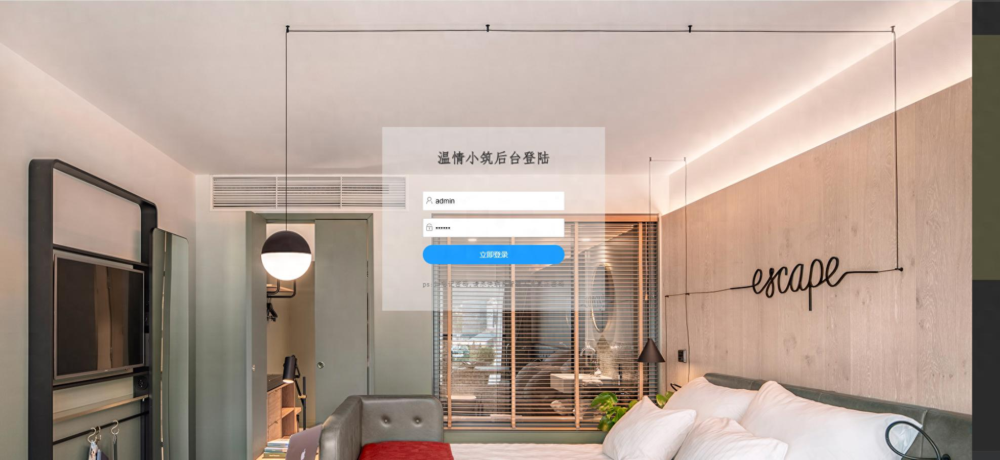
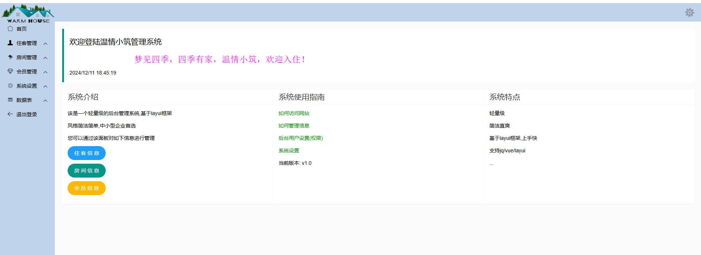
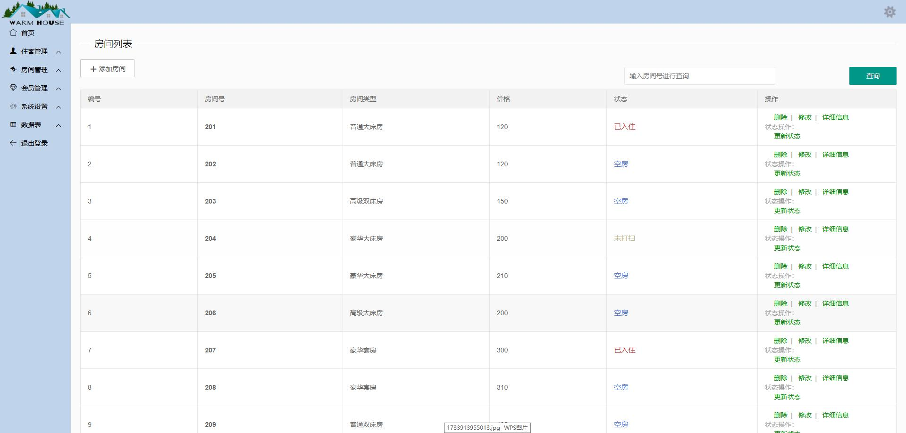
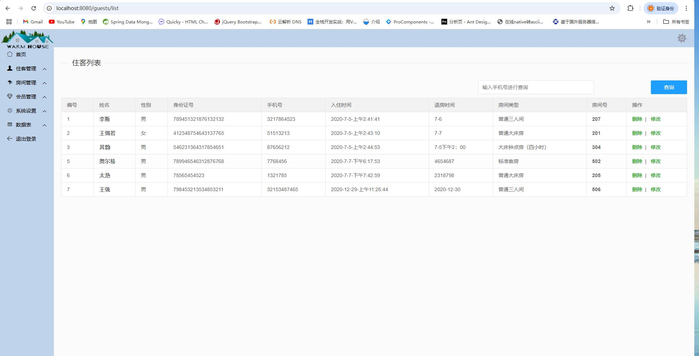
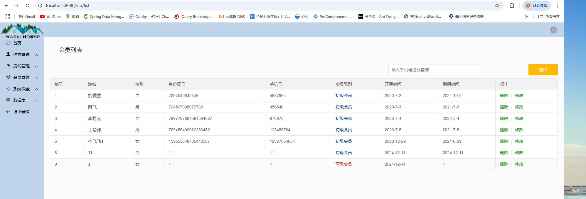
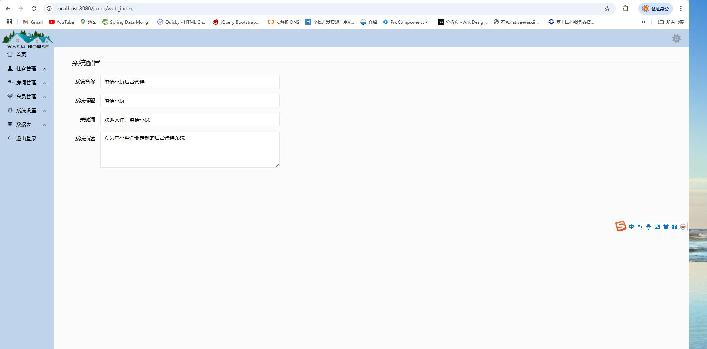
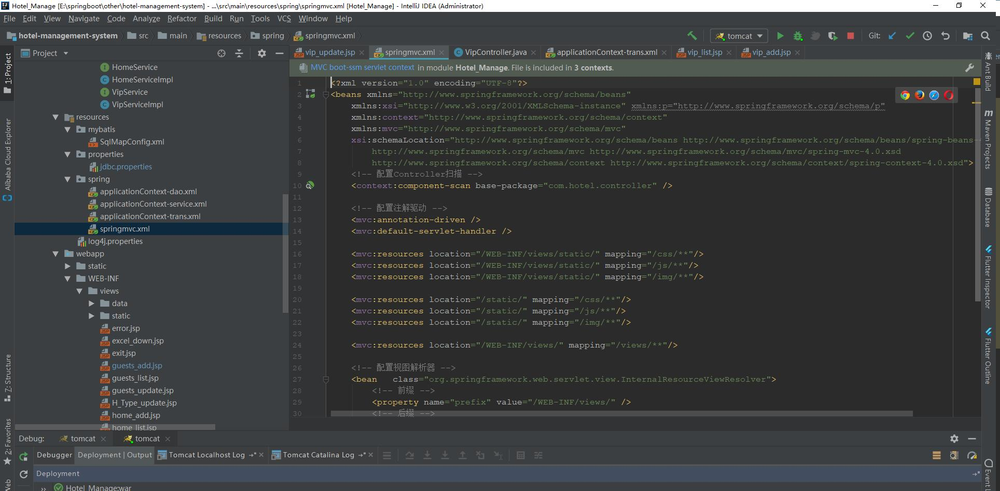

# 一.系统架构

springmvc+jsp+layui+mysql

# 二.功能特性

*   简单易学习，虽然版本比较老但是部署方便，tomcat环境即可启用；
*   代码简洁，前后端代码提供可统一学习；
*   祝愿您能成尽快为一位合格的程序员，愿世界没有BUG;

# 三.部分功能截图

1.登录

2.首页

3.房间管理

4.住客管理

5.会员管理

6.系统设置

7.源码截图

***

